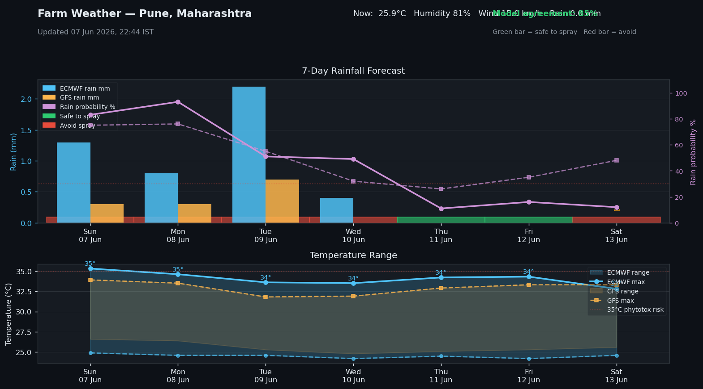

# GK — Personal Life OS

A local, private, multi-module personal assistant. Runs 100% on your machine.

**"Welcome to the future, GK."**

## Farm Weather Dashboard



> ECMWF vs GFS cross-check · Green = safe to spray · Red = avoid · ⚠ = models disagree · Updates every 6 hours

## What is GK?

GK is a router-based personal assistant where each domain (farming, finance, health) is a self-contained module with its own model, memory, and tools. You ask in natural language — GK routes to the right module, blends answers across modules when needed, and never sends your data outside your machine.

## Setup

```bash
# Activate virtualenv
source ~/envs/evn_personal_assistant/bin/activate

# Install dependencies
pip install -r requirements.txt

# Copy and fill your profile
cp user_profile.template.json user_profile.json

# Run
python main.py
```

## Requirements

- [Ollama](https://ollama.com) running locally
- Models: `qwen2.5:0.5b` (router) + `qwen3:1.7b` (text)

```bash
ollama pull qwen2.5:0.5b
ollama pull qwen3:1.7b
```

## Project Structure

```
personal_assistant/
├── core/                    # Router, memory, analysis, guardrails
├── modules/
│   ├── farming/             # Plots, crops, weather, soil, disease KB
│   └── finance/             # Expenses, income, budgets, goals
├── crops/                   # Disease knowledge bases (JSON)
├── docs/design.md           # Full system design and build roadmap
├── main.py                  # Entry point
├── user_profile.template.json
└── requirements.txt
```

## Design

See [docs/design.md](docs/design.md) for the full architecture, confirmed decisions, and build queue.
