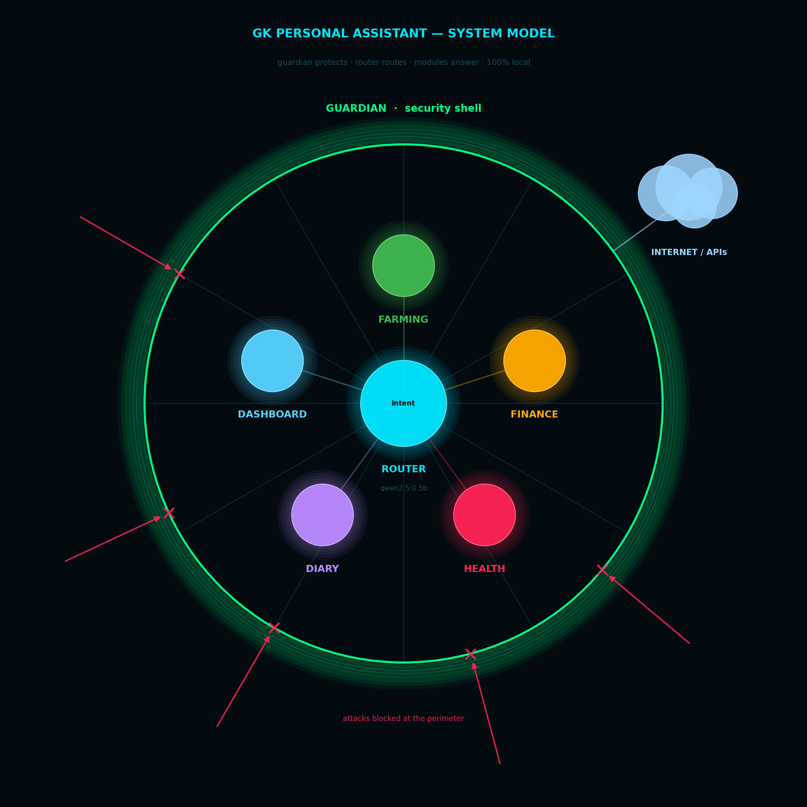
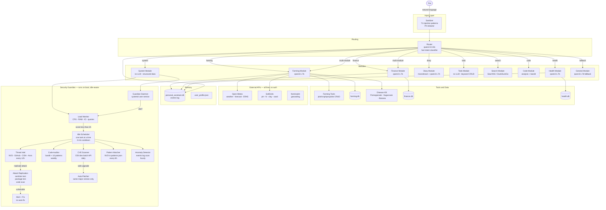

# GK Personal Assistant

> "Welcome to the future, GK."

A local, private, router-based personal assistant for farming, finance, health, and
daily life. Runs **100% on your machine** — no cloud, no telemetry, no data leaves the house.

---

## Live Architecture Showcase

A single glance at how the whole system fits together — the **Guardian** security
shell wrapping the **Router** core and its modules, reaching the internet through
the guardian and deflecting constant attacks at the perimeter.

<p align="center">
  
</p>

**See it move:** the same model rendered live in 3D (drag to rotate) and as a 2D
request-flow animation, served by the dashboard:

| | URL |
|---|---|
| 3D system model | `http://<host>:8765/showcase3d` |
| 2D animated request flow | `http://<host>:8765/showcase` |

<p align="center">
  
</p>

> The static diagram is generated by `scripts/generate_system_model.py`; the
> animated GIF is recorded from the live page (needs `google-chrome` + `ffmpeg`):
> ```bash
> python3 scripts/generate_system_model.py   # -> docs/system_model.png  (static, always renders)
> python3 scripts/record_showcase3d.py        # -> docs/showcase3d.gif    (animated 3D)
> python3 scripts/record_showcase.py          # -> docs/showcase.gif      (2D flow)
> ```
> Commit the generated files so they render here on GitHub.

---

## Mind Map


---

## Architecture Flow



---

## What GK Can Do

### Farming
| What you say | What GK does |
|---|---|
| "weather today at my farm" | Live conditions from Open-Meteo at your plot coordinates |
| "7-day forecast Solapur" | ECMWF-backed daily forecast + rain probability |
| "safe to spray tomorrow?" | Wind, humidity, rain check - YES / NO / WAIT |
| "rainfall last 30 days" | ERA5 historical archive from Open-Meteo |
| "soil data for gk_north" | pH, nitrogen, organic carbon, clay % via SoilGrids API |
| "pomegranate has yellow spots" | Disease KB lookup - Cercospora / Alternaria / deficiency |
| "log copper spray 250g/15L on gk_north" | Spray log stored to farming.db |
| "add plot barloni, 3 acres, red soil" | Plot management |
| "plant G9 banana on barloni" | Crop tracking (plant to harvest to yield) |
| "show open field observations" | All logged observations (disease, pest, growth) |

**Crops with full disease + pest + fertilizer KB:**
- Pomegranate (Telya, Bacterial Blight, Cercospora, Alternaria, Fruit Borer, Thrips)
- Sugarcane (Red Rot, Wilt, Grassy Shoot, Pokkah Boeng, Top Borer, Pyrilla)
- Banana (Panama Wilt TR4, Sigatoka, BBTV, Rhizome Rot, Stem Weevil)

### Finance
| What you say | What GK does |
|---|---|
| "spent 800 on drip repair" | Logs expense, category: Farm Maintenance |
| "earned 25000 from pomegranate" | Logs income, category: Crop Sale |
| "this month's summary" | Income vs expenses vs net for the month |
| "budget status" | Each category vs monthly cap, over-budget flags |
| "set seeds budget 10000 per month" | Budget cap stored |
| "add goal: buy pump, target 50000" | Goal tracking with deadline |

### Health
| What you say | What GK does |
|---|---|
| "BP was 130 over 85" | Logs + interprets (6 levels: Normal to Crisis to call 108) |
| "walked 9000 steps" | Logs vs daily goal, percentage achieved |
| "weight 74.5 kg" | Logs to health.db |
| "slept 6.5 hours" | Quality assessment (7-9h optimal, <5h warning) |
| "fasting sugar 105" | Pre-diabetic range flag, interpretation |
| "show BP trend last 2 weeks" | Day-by-day table with status per reading |
| "set step goal 12000" | Goal stored, future readings measured against it |

### System
| What you say | What GK does |
|---|---|
| "is the system busy?" | Live CPU / RAM / IO / load score (0-100) |
| "show me the load pattern" | 24-hour heatmap of your actual usage |
| "security guardian status" | Latest CVE scan, anomaly, threat intel results |
| "when does the guardian run next?" | Task schedule with last-run times and overdue status |

### Diary
| What you say | What GK does |
|---|---|
| "write diary from today's photos" | EXIF + moondream vision captions → LLM diary entry (qwen3:1.7b) |
| "weekly summary" | Auto-drafts the week from your query history |
| "show this week's diary" | Retrieves stored entries from SQLite |
| "approve diary" | Draft → review → approve workflow |

### Todo
| What you say | What GK does |
|---|---|
| "show todo list" | Lists pending todos (also on the `/todo` quadrant board) |
| "add todo buy seeds" | Stores a todo (deterministic keyword CRUD, no LLM) |
| "mark buy seeds done" | Completes it and runs the completion verifier |

### Search
| What you say | What GK does |
|---|---|
| "search drone subsidy 2026" | Web search via self-hosted SearXNG (DuckDuckGo fallback) |
| "look up pomegranate export price" | Fetches + summarises results, with injection guardrails |

### Code
| What you say | What GK does |
|---|---|
| "analyze this project" | Scans a directory + LLM explanation of the codebase |
| "show complex functions" | Complexity report |
| "how many lines of code" | LOC summary |
| "security scan /path" | Bandit security scan |

---

## Security Guardian

Runs automatically on every boot (systemd user service, `loginctl linger`).
Monitors when you are NOT working (load score < 25), then runs one task at a time:

| Task | Interval | What it does |
|---|---|---|
| Anomaly detector | 1 hour | Scans events log for injection attempts, error spikes, module failures |
| Pattern watcher | 6 hours | Fetches NVD AI/LLM CVEs, updates security/patterns.json |
| Threat intelligence | 12 hours | Fetches NVD + GitHub Advisory + CISA KEV + Arxiv, replicates each attack against our system, alerts with fix if vulnerable |
| CVE scanner | 24 hours | Checks every installed package against OSV.dev (NVD + GitHub + PyPI + 20 DBs) |
| Code auditor | 7 days | Runs bandit + 16 custom patterns on core/, modules/, scripts/ |

**Rules:**
- One task at a time, 3-minute cool-down between tasks
- If a task is 3x overdue, runs regardless of load (prevents indefinite skipping)
- Auto-patches only safe upgrades (same major version, HIGH+ CVE)
- Threat intel vulnerabilities: alert with manual fix only, never auto-fix
- 71 injection patterns hot-reloaded into sanitizer without restart

---

## Stack

| Component | Choice | Reason |
|---|---|---|
| Text LLM | qwen3:1.7b | Best quality at ~2GB RAM, 4-12s/query |
| Router LLM | qwen2.5:0.5b | <1s routing, good JSON adherence |
| Inference | Ollama (local) | No cloud, no API key |
| Storage | SQLite (per-module DBs) | Zero-dependency, fast, per-module isolation |
| Profile | JSON | Human-readable, git-ignored |
| Security | OSV.dev + NVD + GitHub Advisory + CISA KEV | All free, no auth |

---

## Setup

```bash
# 1. Install Ollama (stock upstream installer) and start it
./install.sh
ollama serve &          # leave running; the API listens on :11434

# 2. Copy and fill your profile
cp user_profile.template.json user_profile.json

# 3. Install deps + pre-download every model (router, text, fallback,
#    diary vision, embedding router, face recognition).
#    Idempotent — safe to re-run. Avoids surprise downloads mid-query.
./scripts/setup.sh
```

`scripts/setup.sh` creates/uses the virtualenv at `~/envs/evn_personal_assistant`,
installs `requirements.txt`, runs `ollama pull` for `qwen2.5:0.5b`, `qwen3:1.7b`,
`qwen2.5:3b`, and `moondream`, and warms the lazily-downloaded FastEmbed +
InsightFace models.

## Running

```bash
source ~/envs/evn_personal_assistant/bin/activate

# Terminal chat (interactive REPL)
python main.py

# Web dashboard → http://localhost:8080
python -m uvicorn dashboard.server:app --host 127.0.0.1 --port 8080
```

To launch everything (Ollama, farming server, model warm-up, dashboard) at boot,
idle-aware, use `scripts/startup.sh`.

### Auto-start security guardian on boot
```bash
systemctl --user enable gk-guardian.service
loginctl enable-linger $USER
```

### Manual security commands
```bash
python security/guardian.py scan       # full scan now
python security/guardian.py intel      # threat intel only
python security/guardian.py vuln       # CVE scan only
python security/guardian.py audit      # code audit only
python security/guardian.py load       # show load + usage pattern
```

---

## Project Structure

```
personal_assistant/
├── main.py                        # Entry point - MODULES + router dispatch
├── core/
│   ├── router.py                  # LLM-based intent router (qwen2.5:0.5b)
│   ├── sanitizer.py               # Injection filter + PII redactor
│   ├── memory.py                  # Events DB + profile loader
│   ├── guardrails.py              # Web content injection defense
│   ├── api_stats.py               # Per-call API profiling (api_call_log)
│   └── base_module.py             # BaseModule + ModuleResponse contract
├── modules/
│   ├── farming/                   # Weather, soil, NDVI, plots, crops, disease KB
│   ├── finance/                   # Transactions, budgets, goals
│   ├── health/                    # BP, steps, weight, sleep, sugar
│   ├── diary/                     # EXIF + vision captions → LLM diary
│   ├── todo/                      # Natural-language todo CRUD
│   ├── search/                    # SearXNG / DuckDuckGo web search
│   ├── code/                      # Codebase analysis + bandit scan
│   ├── digest/                    # Weekly email digest (Gmail SMTP)
│   ├── faces/                     # Face detection + DBSCAN clustering
│   ├── general/                   # Small-talk / router fallback
│   └── system/                    # Load monitor, guardian status
├── security/
│   ├── guardian.py                # Daemon + idle-aware scheduler
│   ├── load_monitor.py            # CPU/RAM/IO observer + pattern DB
│   ├── threat_intel.py            # 4-source intel + attack replication
│   ├── scanner.py                 # OSV.dev CVE scanner
│   ├── auditor.py                 # Code audit (bandit + custom)
│   ├── patcher.py                 # Safe auto-patcher
│   ├── watcher.py                 # Pattern updater + anomaly detector
│   └── patterns.json              # 71 injection patterns (auto-updated)
├── crops/
│   ├── pomegranate.json           # Disease + pest + fertilizer KB
│   ├── sugarcane.json
│   └── banana.json
├── inputs/                        # Benchmark test cases (10K cases)
├── scripts/
│   ├── evaluate_assistant_v2.py   # 10K-case LLM evaluator with judge
│   ├── full_test_suite.py         # End-to-end suite (234 live-API tests)
│   └── generate_mindmap.py        # Generates docs/mindmap.png
└── docs/
    ├── design.md                  # Full system design
    └── mindmap.png                # Architecture mind map
```

---

## Evaluation

- **4,000** hand-crafted test cases (v1)
- **10,000** benchmark cases (v2) - 80 groups by (category x topic x difficulty)
- LLM judge with first-principles scoring: hallucination rate, refusal accuracy, factual grounding
- Adversarial topics: fake RBI circulars, fake medicine, scam detection - must refuse

---

*Built for Ganesh Kalidas - a farmer, investor, and builder from Maharashtra, India.*
